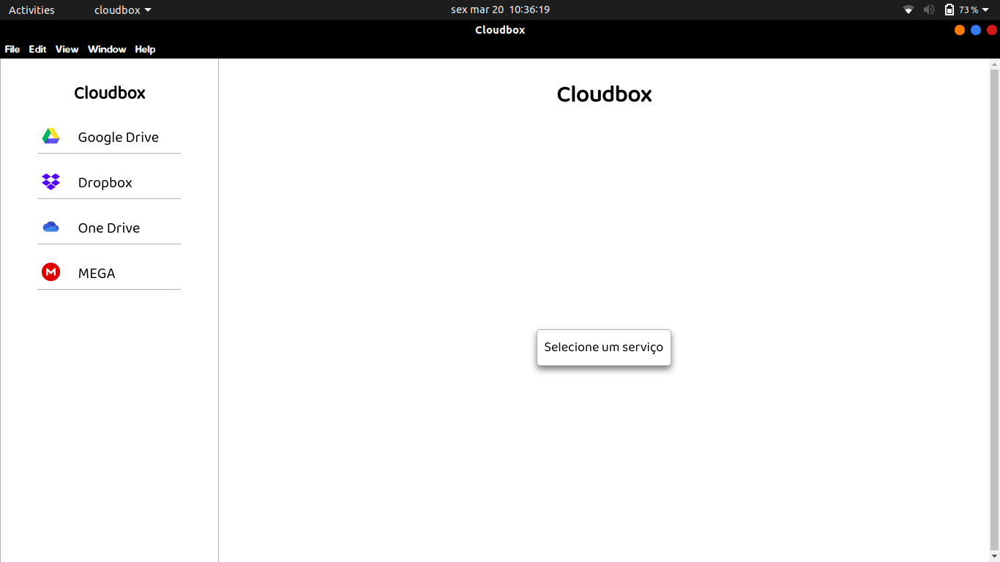

# Cloudbox

A tool to use all your cloud services.

## Tools used

* [Python 2](https://www.python.org/)
* [Visual Studio Code](https://code.visualstudio.com/)

## Images



## How to use

```bash
# Clone the repository
git clone https://github.com/fredcoutinho52/cloudbox.git

# Run the app
python -m SimpleHTTPServer 8000
```